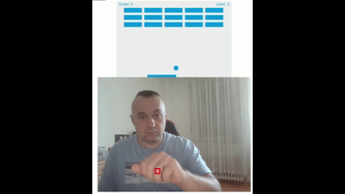
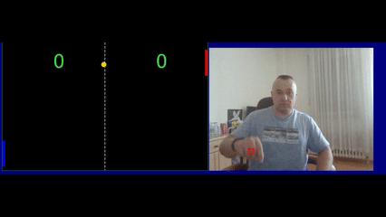

# 👾 JSGames - Games using vanilla Javascript and gesture detection movenet of hand to change gaming 

> ### Website: [https://eugensosna.github.io/JSGames/](https://eugensosna.github.io/JSGames/) 🌐

 

## Games [source](https://github.com/eugensosna/JSGames)

### 1. Arkade 1 : [Link](./Arkade_slow/)
[Arkade 1 Preview](assets/11.gif)
### 2. Arkade 2:[Link](./Arkade3/)

### 3. Ping Pong: [Link](./Ping%20Pong/)

## Contributing

#### Feel free to dive in! [Open an issue](https://github.com/iampavangandhi/JSGames/issues/new) or submit PRs.

## License

#### [MIT](LICENSE) © [Pavan Gandhi](https://github.com/iampavangandhi)

 

---

<h3>Show some ❤️ by starring some of the repositories!</h3>

